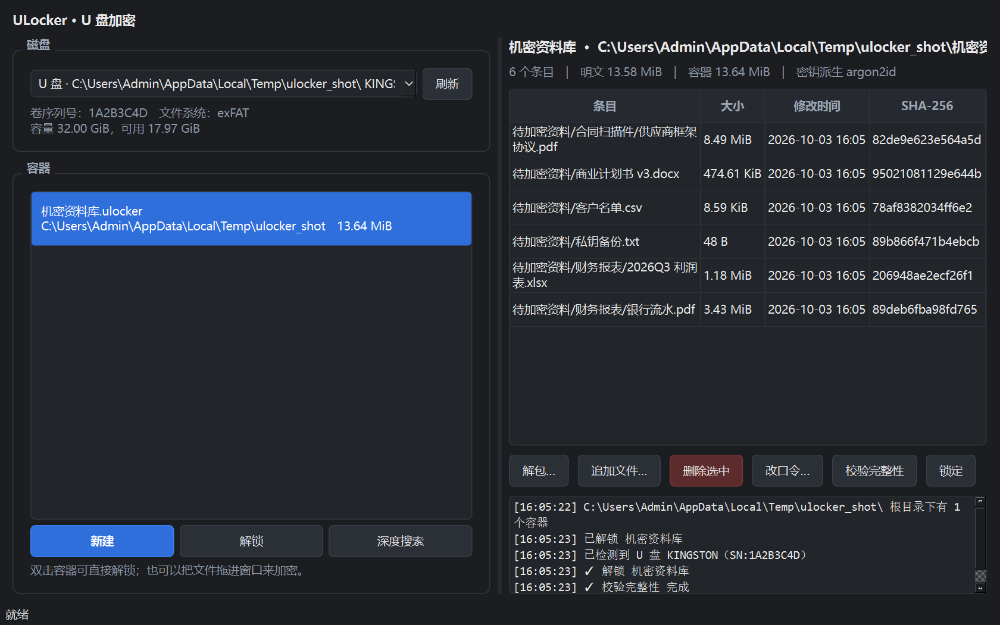

# ULocker · U 盘加密软件

把文件装进一个加密容器丢在 U 盘上——**文件名、目录结构、文件内容全部是密文**，
还能把容器绑定到这块 U 盘的卷序列号，换一块盘就打不开。

```
   U 盘 E:\                        解锁后
┌──────────────────┐          ┌──────────────────────────┐
│ 照片/            │          │ 照片/原图.cr2            │
│ 报价单.xlsx      │          │ 报价单.xlsx              │
│ 合同.pdf         │   ==>    │ 合同.pdf                 │
│ 私钥.txt         │          │ 私钥.txt                 │
│ secret.ulocker   │ ← 只有这一坨密文                     │
└──────────────────┘          └──────────────────────────┘
```

命令行和图形界面都有，Windows / macOS / Linux 都能跑。



- **AES-256-GCM 分块加密**：1 MiB 一块，流式处理，加密 32 GB 的视频也不会吃内存
- **Argon2id 口令派生**：64 MiB / 3 轮内存硬 KDF，抗显卡暴力破解
- **绑定 U 盘**：按卷序列号锁定，容器被拷到别的盘上也打不开
- **不泄漏元数据**：连文件名和目录结构都是密文，`strings` 什么都搜不到
- **改口令是秒级的**：信封加密，换口令只重新包裹一个 32 字节的密钥，不重写数据
- **完整性校验**：每个文件记录 SHA-256，每块独立认证，`verify` 能查出静默损坏
- **零依赖 GUI**：纯 Python + Qt，打包成一个 exe 就能带走

---

## 目录

- [为什么是「加密容器」而不是「全盘加密」](#为什么是加密容器而不是全盘加密)
- [安装](#安装)
- [快速开始](#快速开始)
- [命令速查](#命令速查)
- [图形界面](#图形界面)
- [工作原理](#工作原理)
- [安全模型](#安全模型)
- [打包成单文件 exe](#打包成单文件-exe)
- [开发](#开发)
- [目录结构](#目录结构)
- [许可证](#许可证)

---

## 为什么是「加密容器」而不是「全盘加密」

给 U 盘做**透明的**全盘加密（插上去就像普通盘，读写自动解密）需要在系统里装
文件系统过滤驱动。那意味着：要签名的内核驱动、管理员权限、插到别的电脑上还得
先装驱动才能用——这恰恰最能坑到人，因为别人电脑上装不了。

容器方案把这些坑全绕过去了：

| | 透明全盘加密 | ULocker 容器 |
|---|---|---|
| 别人电脑上用 | 要装驱动，常常装不了 | 拷一个 exe 过去就能开 |
| 权限要求 | 管理员 / 内核驱动 | 普通用户 |
| 便携性 | 绑死在某台机器上 | 容器文件本身就能搬 |
| 代价 | 插上就能透明读写 | 要显式「解包」才能看到文件 |

代价就是**它不是透明的**：你需要先解包才能用文件。对「把敏感资料放进 U 盘带走」
这类场景，「包里是一坨密文、要用的时候解开」通常比「随时能被系统自动解密」
更符合直觉也更安全。

---

## 安装

### 直接跑源码（推荐先这样试）

```bash
git clone https://github.com/yxpil/ULocker.git
cd ULocker
pip install -r requirements.txt      # cryptography + argon2-cffi
python -m ulocker --help
```

想要图形界面再加一个：

```bash
pip install PyQt6
python -m ulocker gui
```

或者装成命令：

```bash
pip install -e .            # 提供 ulocker / ulocker-gui 两个命令
pip install -e ".[gui]"     # 连 GUI 一起装
```

### 从 GitHub Releases 下载 exe

Windows 用户可以直接下载 `ULocker.exe`（图形界面）或 `ulocker.exe`（命令行），
双击即用，不需要装 Python。构建方法见[打包成单文件 exe](#打包成单文件-exe)。

---

## 快速开始

插上 U 盘（假设是 `E:`），把要保护的东西塞进容器：

```bash
# 1. 看看盘符和卷序列号
ulocker drives

# 2. 把 D:\projects 整个加密进 E:\secret.ulocker
#    容器在 U 盘上 → 默认自动绑定这块 U 盘
ulocker new E:\secret.ulocker D:\projects

# 3. 想删掉原来的明文（覆写后删除）
ulocker new E:\secret.ulocker D:\projects --shred-source
```

拿走 U 盘。到别的机器上想要文件时：

```bash
# 在 U 盘上找容器
ulocker find E:\

# 看里面有什么
ulocker list E:\secret.ulocker

# 解包到当前目录
ulocker extract E:\secret.ulocker -C .\restore
```

实际运行起来是这样（真实输出）：

```console
$ ulocker drives --no-color
挂载点  类型      卷标        卷序列号  文件系统  容量        可用
------  --------  ----------  --------  --------  ----------  ----------
E:\     可移动磁盘  KINGSTON   1A2B3C4D  exFAT     29.72 GiB   21.08 GiB

$ ulocker new E:\secret.ulocker .\src --no-bind -p 'correct horse battery staple'
  密钥派生：argon2id
  U 盘绑定：绑定到 U 盘 E:\ KINGSTON SN:1A2B3C4D
✓ 已创建容器 E:\secret.ulocker（4 个条目，明文 5.54 MiB → 加密后 5.61 MiB）

$ ulocker list E:\secret.ulocker
条目                        大小        修改时间          SHA-256
--------------------------  ----------  ----------------  ------------
src/代码/main.py            6.35 KiB    2026-10-03 15:58  ddca3953fde1
src/大文件.bin              5.25 MiB    2026-10-03 15:58  60393f1ced5c
src/项目文档/截图/界面.png  292.97 KiB  2026-10-03 15:58  ec0611f64ac7
src/项目文档/需求v1.txt     3.91 KiB    2026-10-03 15:58  629dbc962e14

  共 4 个条目，明文合计 5.54 MiB

$ ulocker verify E:\secret.ulocker
✓ 全部校验通过：4 个条目 / 5.54 MiB

$ ulocker extract E:\secret.ulocker -C .\restore
✓ 已解包 4 个文件到 C:\restore
```

> 小技巧：口令可以直接写在命令行（`-p`），也可以设 `ULOCKER_PASSWORD` 环境变量，
> 或者干脆不给——程序会安全地提示输入，且不会留在 shell 历史里。

---

## 命令速查

| 命令 | 作用 |
|---|---|
| `ulocker drives` | 列出磁盘，含**卷序列号**（就是绑定用的那个） |
| `ulocker find [路径]` | 在某个盘里搜索所有 `.ulocker` 容器 |
| `ulocker new <容器> [路径...]` | 新建容器并加密文件 / 目录 |
| `ulocker add <容器> <路径...>` | 往已有容器追加内容（只追加，不重写） |
| `ulocker list <容器>` | 列出容器里的条目 |
| `ulocker extract <容器> [条目...]` | 解密到目录，可只解某几个条目 |
| `ulocker del <容器> <条目...>` | 删除条目并回收空间（会重排数据区） |
| `ulocker passwd <容器>` | 改口令，**秒级完成**，不重写数据 |
| `ulocker verify <容器>` | 全量校验，能查出静默损坏 |
| `ulocker info <容器>` | 查看容器信息；不给口令也能看头部 |
| `ulocker shred <文件...>` | 覆写后删除文件（覆写遍数用 `--passes`） |
| `ulocker gui` | 启动图形界面 |

### 全局选项

| 选项 | 说明 |
|---|---|
| `-p, --password` | 直接给口令（建议改用环境变量或交互输入） |
| `--ignore-drive-binding` | 忽略 U 盘绑定，换盘后强制打开 |
| `--json` | 结果以 JSON 输出，方便脚本调用 |
| `-q, --quiet` | 只输出错误 |
| `--no-color` | 关闭彩色输出（也认 `NO_COLOR` 环境变量） |

### `new` 的常用选项

| 选项 | 说明 |
|---|---|
| `--bind` / `--no-bind` | 强制绑定 / 不绑定。默认：容器在**可移动磁盘**上就自动绑定 |
| `--bind-serial 1A2B3C4D` | 按指定卷序列号绑定（在 A 机器上给 B 的 U 盘准备容器时用） |
| `--kdf argon2id\|scrypt` | 换密钥派生算法（默认 Argon2id） |
| `--argon2-memory 262144` | Argon2id 内存开销，单位 KiB（默认 65536 = 64 MiB） |
| `--shred-source` | 加密后安全擦除源文件 |
| `--force` | 覆盖已存在的容器 |

`--json` 让它可以被脚本调用：

```console
$ ulocker list E:\secret.ulocker --json
[{"name": "src/代码/main.py", "size": 6500, "offset": 0, "chunk": "9f3c…", …}]

$ ulocker extract E:\secret.ulocker --json | jq -r '.[]'
C:\restore\src\代码\main.py
```

---

## 图形界面

```bash
python -m ulocker gui        # 或 ulocker-gui
```

界面分三块：

- **左侧**：磁盘下拉框（自动优先选中 U 盘）、该盘上的容器列表
- **右侧**：容器内条目表格，下面是解包 / 追加 / 删除 / 改口令 / 校验按钮
- **底部**：实时进度条与操作日志

顺手的地方：

- 双击容器即可解锁
- **把文件直接拖进窗口**就能加密（已解锁 → 追加；没解锁 → 问你要不要新建容器）
- 所有耗时操作都在后台线程，界面不会卡死
- 建完容器自动帮你解锁，接着就能看到内容

---

## 工作原理

### 密钥分层（信封加密）

```
口令 ──Argon2id──▶ KEK ──HKDF-SHA256──▶ index_key ──▶ 解开索引
                                                        │
                                          ┌─────────────┘
                                          ▼
                                     data_key (随机 32 B)
                                          │
                                          └──AES-256-GCM──▶ 数据区
```

**数据密钥和口令解耦**是这套设计的核心。带来的直接好处：

1. **改口令是瞬间的**。只需要用新 KEK 重新加密一次索引（几百字节），
   一个 32 GB 的容器改口令毫秒级完成，而不是整盘重写几小时。
2. **没有后门**。`data_key` 只以密文形式存在于索引里，索引又由口令派生的密钥
   保护。忘记口令 = 数据在密码学上无法恢复。程序里不存在任何恢复通道。

### 分块加密

大文件按 1 MiB 切块，每块用**独立的随机 nonce** 加密，块的 AAD 是
`chunk_id ‖ 分块序号`：

- 攻击者**不能**把 A 文件的块搬到 B 文件（`chunk_id` 对不上）
- 攻击者**不能**调换同文件内块的顺序或抽掉中间的块（`seq` 对不上）

加上每个条目的 SHA-256，任何篡改都会在解包时被抓住，而不会静默地给你一个
"看起来正常"的坏文件。

### 头部预留区

头部（含加密索引）前面预留了至少 64 KiB 的零填充空间。追加条目时索引变大，
但通常仍然装得进原来的预留区，于是**只重写文件开头几百字节**就能把新条目登记
进去，数据区一个字节都不用动。只有索引大到装不下时才搬一次数据区。

完整的字节级规范见 **[docs/FORMAT.md](docs/FORMAT.md)**。

---

## 安全模型

### 能防住什么

- **U 盘丢了**：没有口令，容器里连一个文件名都看不到。
- **拷到别的机器上**：绑定过的容器在别的盘上直接拒绝打开。
- **静默损坏 / 被人改了一字节**：GCM 认证 + SHA-256 双重把关，解包时立刻报错。
- **暴力破解口令**：Argon2id 64 MiB 内存开销，让 GPU 集群的优势大幅缩水。
  真要用 GPU 硬碰，一个 `--argon2-memory 1048576` + 长口令的组合能把成本顶上去。
- **删了明文还想恢复**：`--shred-source` 会覆写后再删除。

### 防不住什么

说清楚这些比列一堆优点更重要：

| 场景 | 说明 |
|---|---|
| **键盘记录器 / 内存转储** | 口令和解密后的数据以明文出现在内存里，被内核级恶意软件盯着就没辙 |
| **容器处于解锁状态** | 解锁期间解包出来的文件是明文，落在哪里就归那个位置的安全策略管 |
| **弱口令** | 加密算法再强也挡不住 `123456`。程序会在口令短于 8 位时警告，但不会阻止你 |
| **闪存上的「安全擦除」** | 见下 |
| **元数据侧信道** | 容器**大小**会暴露明文总量；但分块固定 1 MiB，所以单个文件的大致大小也能被推算出来 |
| **U 盘序列号被伪造** | 卷序列号不是硬件防篡改的，专业攻击者能改。它防的是"顺手把容器拷到别的盘"，不是芯片级对手 |

**关于 `shred` 的重要提醒**：在 SSD、U 盘这类带磨损均衡（wear leveling）的闪存上，
覆写**无法保证**物理块真被覆盖——闪存控制器会把新数据写到别的块，旧数据仍留在
原来的物理块上，直到被回收。所以 `shred` 只能防御文件系统层面的恢复工具，**不是**
取证级的安全擦除。真正的安全擦除需要厂商工具或者干脆一开始就全盘加密。

> 最稳妥的做法：对敏感数据**先加密再拷贝**（用 `new --shred-source`），
> 而不是先拷到 U 盘再指望擦掉。

---

## 打包成单文件 exe

```bash
pip install pyinstaller
python scripts/build_exe.py
```

产物：

| 文件 | 说明 |
|---|---|
| `dist/ULocker.exe` | 图形界面版，双击即用（无控制台窗口） |
| `dist/ulocker.exe` | 命令行版（有控制台窗口） |

两个 exe 合计约 40 MB（PyQt6 占大头）。只想要命令行版的话：

```bash
python scripts/build_exe.py --cli-only
```

构建脚本内部用的是 `ULocker.spec`，可以直接改它来加图标、改版本号等等。

---

## 开发

```bash
pip install -e ".[dev]"
pytest                     # 176 个测试
pytest -q tests/test_vault.py -k tamper    # 只跑某类
```

测试覆盖了：加解密往返、分块边界（正好整数倍 / 只差一字节）、空文件、空容器、
中文与 emoji 文件名、口令错误、密文篡改、头部篡改、数据区篡改、目录穿越攻击、
追加回滚、删除整理、改口令、U 盘绑定匹配与不匹配。

测试里把 KDF 参数调到最小（16 KiB / 1 轮）以保证跑得快，真实使用时用的是
`crypto.py` 里的强参数。整个套件大约 3 秒跑完。

代码风格上没有引入 linter 依赖，保持「能读懂」优先：模块级 docstring 说明设计
取舍，函数带类型注解，异常统一继承 `ULockerError`。

---

## 目录结构

```
ULocker/
├── ulocker/
│   ├── __init__.py      对外 API 与版本
│   ├── crypto.py        加密原语：KDF、密钥分层、AES-GCM 封装
│   ├── vault.py         容器格式读写：加解密、追加、删除、改口令、校验
│   ├── drives.py        磁盘识别（Windows 走 ctypes，零依赖）
│   ├── util.py          路径安全、体积格式化、安全擦除
│   ├── cli.py           命令行界面
│   ├── gui.py           图形界面（PyQt6）
│   └── errors.py        异常类型
├── tests/               176 个测试
├── docs/FORMAT.md       容器格式规范（字节级）
├── scripts/build_exe.py 打包脚本
├── ULocker.spec         PyInstaller 配置
└── requirements.txt
```

---

## 许可证

MIT © 2026 yxpil

---

<div align="center">

<a href="https://github.com/yxpil/ULocker">
  
</a>

<sub>Powered by <a href="https://alittlecatgirlpanel.yxp.hk"><b>gh-card</b></a> · 粉色手写体 README 仓库名片</sub>

</div>
